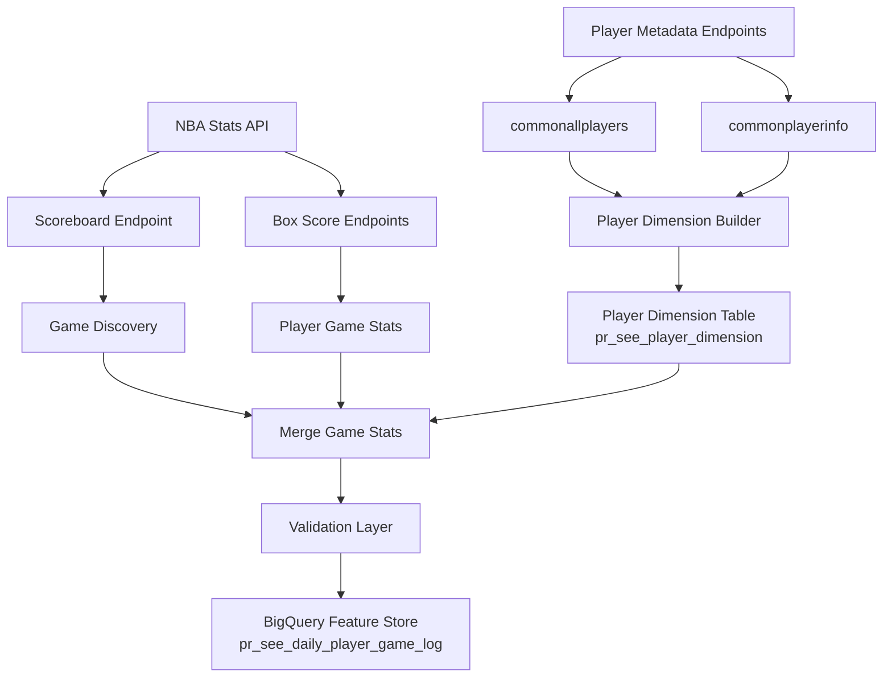

# NBA Feature Store Pipeline
Production-style NBA data pipeline that builds a partitioned BigQuery feature store from NBA Stats API endpoints for analytics and modeling workflows.

The pipeline is designed using modular data engineering architecture patterns including ingestion orchestration, schema enforcement, validation layers, and warehouse partitioning.


## What This Project Does

This project builds a **production-style sports analytics data pipeline** that:

• Collects NBA game data from the NBA Stats API  
• Merges multiple endpoints into player-level feature sets  
• Validates data integrity and schema consistency  
• Loads the results into a **partitioned BigQuery feature store**

The pipeline generates over **90 player-level features per NBA game**.
Each NBA game date is processed as an **atomic ingestion unit**, ensuring that partial or corrupted data never enters the feature store.

NBA Stats API → Dimension Builder + Ingestion Engine → Validation Layer → BigQuery Feature Store

## Project Status

Production-style NBA data pipeline that ingests player-level game statistics from the NBA Stats API into a partitioned BigQuery feature store.

Current capabilities:

• Automated daily ingestion  
• Schema-locked feature store  
• Monitoring and integrity audits  
• Failure alerting and retry protection  
• Historical backfill support  

This repository represents **Phase 1: Data Infrastructure** for a larger sports analytics platform.

## Overview

This project implements a production-style NBA data pipeline that ingests player game statistics from the NBA Stats API and stores them in a partitioned Google BigQuery feature store.

The system retrieves data from multiple NBA API endpoints, merges player-level statistics, performs validation checks, and loads the results into a structured analytics warehouse designed for modeling and downstream analysis.

This repository represents **Phase 1 — Data Infrastructure**, which builds the core feature store layer used for sports analytics and predictive modeling workflows.

The pipeline was initially prototyped in a notebook environment and later refactored into a modular Python data pipeline following common data engineering architecture patterns.

---

## Architecture



The pipeline follows a modular data engineering architecture. NBA game data is collected from multiple NBA Stats API endpoints and merged into player-level feature sets. A dedicated dimension builder maintains a centralized player metadata table, which is joined during ingestion to enrich game-level statistics. The ingestion engine performs validation checks before loading the final dataset into a partitioned BigQuery feature store designed for analytical workloads and modeling pipelines.

This architecture separates **dimension construction** from the daily ingestion pipeline.

Game data is collected from multiple NBA Stats API endpoints and merged into player-level feature sets.  
Stable player metadata is stored in a dimension table and joined during ingestion to enrich the final dataset before loading into the BigQuery feature store.

---

## Example Output

### Example Pipeline Execution

The pipeline runs as a command-line job and processes NBA game dates as atomic ingestion batches.

The default configuration runs in **AUTO_YESTERDAY_MODE**, which automatically ingests the previous day's NBA games.

Example pipeline execution:


### Feature Store Example

Example rows stored in the BigQuery feature store.

The table contains over **90 player-level features** generated from multiple NBA Stats API endpoints.


### Example Dataset

A small sample dataset is included to demonstrate the structure of the
player-level feature store generated by the pipeline.

Location:

data/sample/example_player_game_log.csv

The dataset contains 10 rows of real pipeline output exported from BigQuery for a
single NBA game date. 

Each row represents a player's performance in a specific NBA game.

The full production feature store contains **90 player-level features per game**.

---

## Quick Start

Clone the repository:

```bash
git clone https://github.com/zh412/nba-feature-store.git
cd nba-feature-store
```

Create a virtual environment:

```bash
python3 -m venv .venv
source .venv/bin/activate
```

Install dependencies:

```bash
pip install -r requirements.txt
```

Configure Google Cloud credentials:

```bash
export GOOGLE_APPLICATION_CREDENTIALS="/path/to/service_account.json"
```

Example:

```bash
export GOOGLE_APPLICATION_CREDENTIALS="/Users/username/service_account.json"
```

Configure the pipeline environment:

Open `src/nba_feature_store/config.py` and update the following value:

```python
PROJECT_ID = "your-gcp-project-id"
```

Table names can also be customized if desired, but the defaults will work for most users.
```python
DATASET_ID = "NBA_ANALYTICS"
TABLE_NAME = "pr_see_daily_player_game_log"
PLAYER_DIMENSION_TABLE_NAME = "pr_see_player_dimension"
```
The pipeline automatically creates both tables if they do not already exist.

Run the ingestion pipeline:

```bash
make run
```

The pipeline runs as a Python module using the `src/` package layout.  
Equivalent command:

```bash
PYTHONPATH=src python -m nba_feature_store
```

Run the pipeline followed by all monitoring checks:

```bash
make pipeline-run
```

This project uses a **`src/` package layout**, a common Python packaging pattern that isolates source code from repository root files and improves import reliability. The pipeline is executed as a Python module to mirror production-style package execution.

### Default Behavior (AUTO_YESTERDAY_MODE)

By default the pipeline runs in **AUTO_YESTERDAY_MODE**.

This means the pipeline automatically ingests **yesterday’s NBA games** each time it runs.

Example:

If today is **March 5**, the pipeline will ingest **March 4 games**.

This mode is designed for **automated daily ingestion** during the NBA season.

### Running a Manual Date Range (Backfill)

If you want to ingest specific historical dates instead of yesterday's games, update the configuration in `config.py`.

Example:

```
AUTO_YESTERDAY_MODE = False
START_DATE = "2025-11-01"
END_DATE   = "2025-11-03"
```

Then run:

```
PYTHONPATH=src python -m nba_feature_store
```

### Backfill Safety Guardrail

The pipeline includes a safety limit to prevent excessive API calls.

A maximum of **7 days can be processed per run**.

If you need to backfill a longer period, run the pipeline multiple times with different date ranges.

### Check Pipeline Health

After ingestion you can verify the feature store using the built-in monitoring tools.

Run individually:

make monitor-command     # Feature Store Command Center dashboard  
make monitor-health      # Data health audit (missing dates / duplicates)  
make monitor-integrity   # Game integrity validation  

Run all monitoring checks together:

make monitor-all

## Development Commands

Common development tasks can be run using the Makefile.

```
make install          # install dependencies
make lint             # run flake8
make test             # run unit tests

make run              # execute the ingestion pipeline

make monitor-command  # feature store command center
make monitor-health   # data health audit
make monitor-integrity# game integrity audit
make monitor-all      # run all monitoring checks

make pipeline-run     # run pipeline followed by all monitoring checks

```

The repository includes a GitHub Actions CI pipeline that automatically runs linting and tests on every commit to ensure code quality and stability.

## Testing

The repository includes a small unit test suite for core pipeline utilities.

Run tests locally with:

pytest

These tests verify important pipeline components such as:

• date parsing utilities  
• retry logic for API calls  

Tests automatically run in the GitHub Actions CI pipeline on every commit.

---

## Monitoring

The pipeline includes operational monitoring tools to ensure the feature store remains healthy and data integrity is maintained.

### Data Health Audit

Detects missing ingestion dates, duplicate row keys, and abnormal daily row counts.


### Feature Store Command Center

Operational dashboard showing ingestion freshness, total rows, games ingested, and partition counts.


### Game Integrity Audit

Validates that every NBA game contains the correct number of teams and players and checks for corrupted rows.


## Monitoring the Pipeline

The repository includes three monitoring utilities that provide operational visibility into the health of the feature store and help detect data integrity issues after ingestion.

Each tool can be executed independently.

### Data Health Audit

Checks for common warehouse health issues including:

- missing ingestion dates  
- duplicate row keys  
- abnormal daily row counts  

Run:

```bash
PYTHONPATH=src python -m nba_feature_store.monitoring.data_health_audit
```

### Game Integrity Audit

Validates the structural integrity of ingested games by checking:

- each game contains exactly two teams  
- reasonable player counts per team  
- no corrupted player rows  

Run:

```bash
PYTHONPATH=src python -m nba_feature_store.monitoring.game_integrity_audit
```

### Feature Store Command Center

Provides a high-level operational overview of the warehouse including:

- ingestion freshness  
- total rows stored  
- total games ingested  
- number of partitions  

Run:

```bash
PYTHONPATH=src python -m nba_feature_store.monitoring.feature_store_command_center
```

Together these tools help verify ingestion completeness and ensure the feature store remains reliable for downstream analytics and modeling workflows.

---

## Core Pipeline Capabilities

### Reliable Data Ingestion

The pipeline implements retry logic with exponential backoff to protect against temporary API failures or unstable network conditions.

### Rate Limit Protection

An adaptive rate governor dynamically adjusts request pacing to prevent NBA Stats API throttling.

### Data Validation

Before ingestion the pipeline validates:

- duplicate row keys
- missing player IDs
- corrupted merges
- negative minutes
- empty dataframes

These safeguards prevent corrupted records from entering the feature store.

### Atomic Day-Level Ingestion

Each game date is processed as a complete atomic unit.

If any game fails during ingestion, the entire day is aborted to prevent partial or inconsistent data loads.

### Safe Historical Backfills

The ingestion system includes a batch processing engine which allows controlled historical ingestion while protecting against API throttling.

---

## Key Features

- Multi-endpoint NBA API ingestion
- Persistent NBA API session management
- Retry-protected API calls with exponential backoff
- Adaptive rate limiting to prevent API throttling
- Schema-locked warehouse design
- Partitioned BigQuery feature store
- Idempotent ingestion (safe reruns)
- Data validation safeguards
- Automated integrity audits and monitoring tools
- Batch ingestion engine for safe historical backfills

These safeguards ensure the pipeline remains stable, reliable, and reproducible during daily ingestion.

---

## Feature Store Design

The pipeline loads player game statistics into a partitioned BigQuery feature store designed for analytics and modeling workloads.

The warehouse design separates **stable player metadata** from **game-level performance features** using a small dimension table joined during ingestion.

This approach reduces redundant API calls and ensures consistent player attributes across all game records.

---

### Player Dimension Table

`pr_see_player_dimension`

The player dimension table stores metadata attributes that do not change on a per-game basis.

Columns:

- PLAYER_ID
- POSITION
- HEIGHT
- EXP

This table is built automatically by the pipeline if it does not already exist.

The dimension builder retrieves metadata from the NBA Stats API endpoints:

- `commonallplayers`
- `commonplayerinfo`

During ingestion, the pipeline loads this dimension table and joins it to player game logs to enrich each row with player metadata before loading the final dataset into the feature store.

---

### Player Game Feature Store

`pr_see_daily_player_game_log`

This table contains player-level game features generated by merging multiple NBA Stats API endpoints.

Each row represents a **single player in a single NBA game**.

The pipeline generates **over 90 player-level features per game** including traditional statistics, advanced metrics, usage statistics, and team context features.

#### Partitioning

`GAME_DATE`

Partitioning by game date allows efficient time-series queries and prevents full-table scans.

#### Clustering

`PLAYER_ID`  
`TEAM_ID`

Clustering improves query performance for common analytical workloads such as:

- player performance trends
- team-level aggregations
- matchup analysis

Partition filtering is enforced to control BigQuery query costs and maintain warehouse efficiency.

---

## Data Sources

The pipeline collects data from multiple NBA Stats API endpoints which are merged to generate the final feature set.

Game discovery:

- `scoreboardv3`

Player box score statistics:

- `boxscoretraditionalv3`
- `boxscoreadvancedv3`
- `boxscoreusagev3`
- `boxscorefourfactorsv3`

Game metadata:

- `boxscoresummaryv3`

Player metadata:

- `commonallplayers`
- `commonplayerinfo`

---

## Technology Stack

- Python
- NBA Stats API (`nba_api`)
- Google BigQuery
- Google Cloud Platform
- Pandas
- Requests
- GitHub Actions (CI/CD)
- Pytest
- Flake8

---

## Project Structure

```
nba-feature-store
│
├── src
│   └── nba_feature_store
│       ├── __init__.py
│       ├── __main__.py
│       ├── main.py
│       ├── config.py
│       ├── schema.py
│       │
│       ├── dimensions
│       │   └── build_player_dimension.py
│       │
│       ├── ingestion
│       │   ├── ingestion_engine.py
│       │   ├── pull_games.py
│       │   ├── batch_engine.py
│       │   ├── team_context.py
│       │   └── game_metadata.py
│       │
│       ├── utils
│       │   ├── retry.py
│       │   ├── validation.py
│       │   ├── logging.py
│       │   ├── dates.py
│       │   ├── nba_session.py
│       │   ├── rate_governor.py
│       │   ├── schema_enforcer.py
│       │   ├── post_load_check.py
│       │   ├── run_tracker.py
│       │   └── email_alert.py
│       │
│       └── monitoring
│           ├── data_health_audit.py
│           ├── game_integrity_audit.py
│           └── feature_store_command_center.py
│
├── tests
│   ├── test_dates.py
│   ├── test_retry.py
│   ├── test_rate_governor.py
│   └── test_schema_enforcer.py
│
├── data
│   └── sample
│       └── example_player_game_log.csv
│
├── docs
│   ├── pipeline_run.png
│   ├── feature_store_example_1.png
│   ├── feature_store_example_2.png
│   ├── nba_feature_store_pipeline_architecture.png
│   ├── data_health_audit.png
│   ├── game_integrity_audit.png
│   └── feature_store_command_center.png
│
├── logs
│
├── .github
│   └── workflows
│       └── ci.yml
│
├── requirements.txt
├── pytest.ini
├── Makefile
├── README.md
└── LICENSE
```

### Structure Overview

**main.py** — pipeline entry point responsible for orchestrating ingestion runs

**config.py** — pipeline configuration including BigQuery settings, runtime mode, and ingestion date controls

**schema.py** — BigQuery feature store schema definition used to enforce consistent column structure during ingestion

**dimensions/** — contains the player dimension builder that constructs a persistent metadata table for player attributes such as position, height, and experience

**ingestion/** — core ingestion engine and NBA API pull logic responsible for retrieving game data, merging endpoint results, and preparing player-level feature sets

**utils/** — reusable pipeline utilities including retry logic, logging, validation, session management, rate limiting, and schema enforcement

**monitoring/** — operational monitoring tools that audit feature store health, detect data integrity issues, and provide ingestion status dashboards

**tests/** — unit tests for core pipeline utilities and infrastructure components such as retry logic, schema enforcement, and rate governance

**docs/** — documentation assets and screenshots demonstrating pipeline execution and monitoring dashboards

**data/sample/** — example dataset showing the structure of the generated BigQuery feature store output

---

## Pipeline Automation

The pipeline is designed to run automatically once per day during the NBA season.

A lightweight local scheduler is configured using cron to execute the pipeline at 1:00 PM Eastern Time, which ingests the previous day’s NBA games and runs the full monitoring suite.

Example configuration:
0 13 * * * cd /your/project/directory/nba-feature-store && make pipeline-run >> logs/pipeline_$(date +\%Y-\%m-\%d).log 2>&1

This command performs the following steps:
	1.	Navigates to the project directory
	2.	Executes the full pipeline workflow using the Makefile (make pipeline-run)
	3.	Runs all monitoring checks after ingestion
	4.	Writes pipeline output to a dated log file for debugging and observability

Example log output location:
logs/pipeline_2026-03-08.log

Using dated log files prevents a single log from growing indefinitely and allows easier inspection of individual pipeline runs.

This automation ensures the BigQuery feature store remains continuously updated without manual intervention.

Cron Schedule Format
* * * * *
│ │ │ │ │
│ │ │ │ └── day of week
│ │ │ └──── month
│ │ └────── day of month
│ └──────── hour
└────────── minute

The schedule:
0 13 * * *
means the pipeline runs every day at 1:00PM

Why 1:00 PM?

NBA games often finish after midnight due to West Coast start times. Running the pipeline at 1 PM Eastern Time ensures that all previous day’s games have finalized and are available through the NBA Stats API before ingestion begins.

The pipeline also includes:

• automatic retry logic for unstable API calls  
• adaptive rate limiting to prevent NBA API throttling  
• failure detection with alert notifications  

These safeguards allow the system to operate as a reliable automated data pipeline.

---

For additional warehouse design details see:

docs/data_model.md

---

## Future Work (Phase 2)

Phase 2 will extend the feature store into a full sports analytics system including:

- player projection models
- feature engineering pipelines
- performance modeling
- predictive analytics workflows

The current feature store serves as the data infrastructure foundation for these analytical systems.

---

## Author

ZH