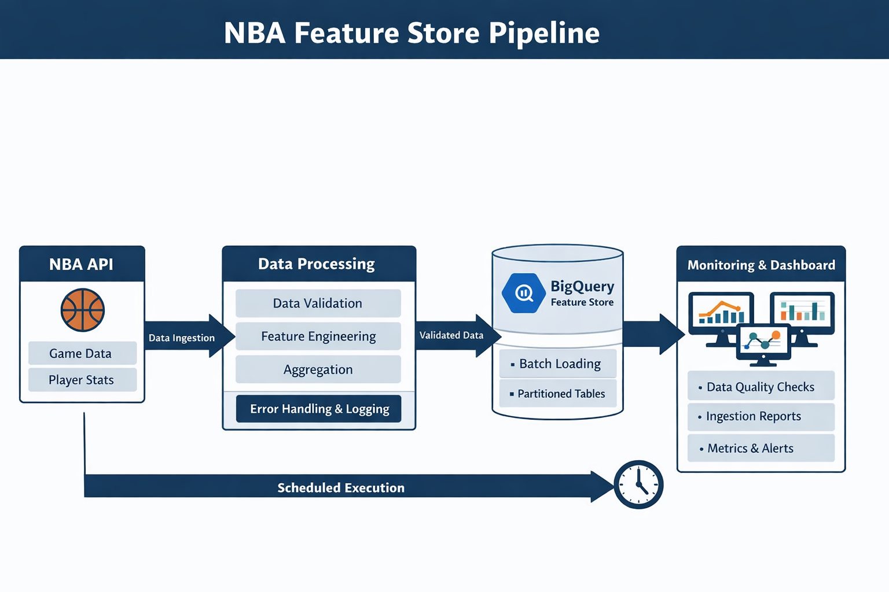
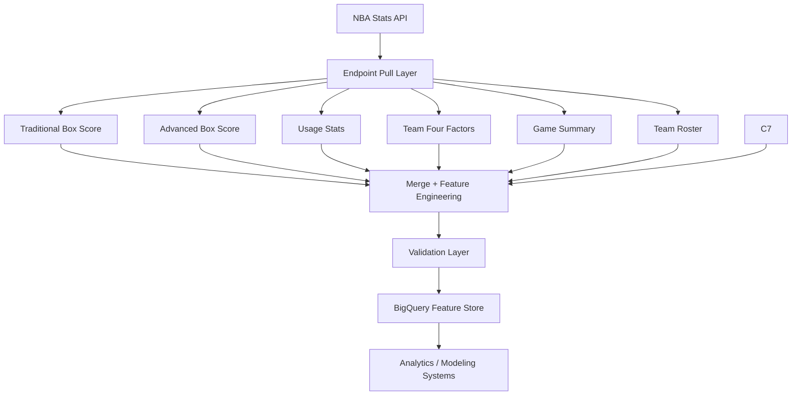

# NBA Feature Store Pipeline
Production-style NBA data pipeline that builds a partitioned BigQuery feature store from NBA Stats API endpoints for analytics and modeling workflows.


## What This Project Does

This project builds a **production-style sports analytics data pipeline** that:

• Collects NBA game data from the NBA Stats API  
• Merges multiple endpoints into player-level feature sets  
• Validates data integrity and schema consistency  
• Loads the results into a **partitioned BigQuery feature store**

⭐ Example: The pipeline generates **91 player-level features per NBA game**.
Each NBA game date is processed as an **atomic ingestion unit**, ensuring that partial or corrupted data never enters the feature store.

NBA Stats API → Ingestion Pipeline → Validation Layer → BigQuery Feature Store → Analytics / Modeling

## Project Status

Production-ready NBA data pipeline that ingests player-level game statistics from the NBA Stats API into a partitioned BigQuery feature store.

Current capabilities:

• Automated daily ingestion  
• Schema-locked feature store  
• Monitoring and integrity audits  
• Failure alerting and retry protection  
• Historical backfill support  

This repository represents **Phase 1: Data Infrastructure** for a larger sports analytics platform.



## Overview

This project implements a production-style NBA data pipeline that ingests player game statistics from the NBA Stats API and stores them in a partitioned Google BigQuery feature store.

The system retrieves data from multiple NBA API endpoints, merges player-level statistics, performs validation checks, and loads the results into a structured analytics warehouse designed for modeling and downstream analysis.

This repository represents **Phase 1 — Data Infrastructure**, which builds the core feature store layer used for sports analytics and predictive modeling workflows.

The pipeline was initially prototyped in a notebook environment and later refactored into a modular Python data pipeline following common data engineering architecture patterns.

---

## Quick Start

Clone the repository:

```
git clone https://github.com/zh412/nba-feature-store.git
cd nba-feature-store
```

Create a virtual environment:

```
python3 -m venv .venv
source .venv/bin/activate
```

Install dependencies:

```
pip install -r requirements.txt
```

Configure Google Cloud credentials:

```
export GOOGLE_APPLICATION_CREDENTIALS="/path/to/service_account.json"
```

Example:

```
export GOOGLE_APPLICATION_CREDENTIALS="/Users/username/service_account.json"
```

Configure the pipeline:

Open `config.py` and update the following values:

```
BQ_PROJECT_ID = "your-project-id"
DATASET_ID = "NBA_ANALYTICS"
TABLE_NAME = "pr_see_daily_player_game_log"
```

Run the pipeline:

```
make run
```

Run the pipeline and execute all monitoring checks:

```
make pipeline-run
```

This project uses a **`src/` package layout**, a common Python packaging pattern that isolates source code from repository root files and improves import reliability. The pipeline is executed as a Python module to mirror production-style package execution.

### Default Behavior (AUTO_YESTERDAY_MODE)

By default the pipeline runs in **AUTO_YESTERDAY_MODE**.

This means the pipeline automatically ingests **yesterday’s NBA games** each time it runs.

Example:

If today is **March 5**, the pipeline will ingest **March 4 games**.

This mode is designed for **automated daily ingestion** during the NBA season.

### Running a Manual Date Range (Backfill)

If you want to ingest specific historical dates instead of yesterday's games, update the configuration in `config.py`.

Example:

```
AUTO_YESTERDAY_MODE = False
START_DATE = "2025-11-01"
END_DATE   = "2025-11-03"
```

Then run:

```
PYTHONPATH=src python -m nba_feature_store
```

### Backfill Safety Guardrail

The pipeline includes a safety limit to prevent excessive API calls.

A maximum of **7 days can be processed per run**.

If you need to backfill a longer period, run the pipeline multiple times with different date ranges.

### Check Pipeline Health

After ingestion you can verify the feature store using the built-in monitoring tools.

Run individually:

make monitor-command     # Feature Store Command Center dashboard  
make monitor-health      # Data health audit (missing dates / duplicates)  
make monitor-integrity   # Game integrity validation  

Run all monitoring checks together:

make monitor-all

## Development Commands

Common development tasks can be run using the Makefile.

```
make install          # install dependencies
make lint             # run flake8
make test             # run unit tests

make run              # execute the ingestion pipeline

make monitor-command  # feature store command center
make monitor-health   # data health audit
make monitor-integrity# game integrity audit
make monitor-all      # run all monitoring checks

make pipeline-run     # run pipeline followed by all monitoring checks

```

The repository includes a GitHub Actions CI pipeline that automatically runs linting and tests on every commit to ensure code quality and stability.

## Testing

The repository includes a small unit test suite for core pipeline utilities.

Run tests locally with:

pytest

These tests verify important pipeline components such as:

• date parsing utilities  
• retry logic for API calls  

Tests automatically run in the GitHub Actions CI pipeline on every commit.

## Architecture



This architecture follows a typical analytics engineering pipeline pattern separating ingestion, feature engineering, validation, and warehouse storage layers.

---

## Example Pipeline Execution

The pipeline runs as a command-line job and processes NBA game dates as atomic ingestion batches.

The default configuration runs in **AUTO_YESTERDAY_MODE**, which automatically ingests the previous day's NBA games.

Example pipeline execution:


## Feature Store Example

Example rows stored in the BigQuery feature store.

The table contains over **91 player-level features** generated from multiple NBA Stats API endpoints.


## Example Dataset

A small sample dataset is included to demonstrate the structure of the
player-level feature store generated by the pipeline.

Location:

data/sample/example_player_game_log.csv

The dataset contains 10 rows of real pipeline output exported from BigQuery for a
single NBA game date. 

Each row represents a player's performance in a specific NBA game.

The full production feature store contains **91 player-level features per game**.

## Monitoring and Data Integrity

The pipeline includes operational monitoring tools to ensure the feature store remains healthy and data integrity is maintained.

### Data Health Audit

Detects missing ingestion dates, duplicate row keys, and abnormal daily row counts.


### Feature Store Command Center

Operational dashboard showing ingestion freshness, total rows, games ingested, and partition counts.


### Game Integrity Audit

Validates that every NBA game contains the correct number of teams and players and checks for corrupted rows.


## Key Features

- Multi-endpoint NBA API ingestion
- Persistent NBA API session management
- Retry-protected API calls with exponential backoff
- Adaptive rate limiting to prevent API throttling
- Schema-locked warehouse design
- Partitioned BigQuery feature store
- Idempotent ingestion (safe reruns)
- Data validation safeguards
- Automated integrity audits and monitoring tools
- Batch ingestion engine for safe historical backfills

These safeguards ensure the pipeline remains stable, reliable, and reproducible during daily ingestion.

---

## Feature Store Table

`pr_see_daily_player_game_log`

### Partitioning

`GAME_DATE`

### Clustering

`PLAYER_ID`  
`TEAM_ID`

Partition filtering is enforced to prevent accidental full-table scans and control BigQuery query costs.

The feature store is designed to support modeling-ready player game features.

---

## Data Sources

NBA Stats API endpoints used in this pipeline:

- `boxscoretraditionalv3`
- `boxscoreadvancedv3`
- `boxscoreusagev3`
- `boxscorefourfactorsv3`
- `boxscoresummaryv3`
- `scoreboardv3`
- `commonteamroster`

These endpoints are merged to generate a comprehensive player-level feature set for each NBA game.

---

## Technology Stack

Python  
NBA Stats API (nba_api)  
Google BigQuery 
Google Cloud Platform 
Pandas  
Requests  
GitHub Actions (CI/CD)  
Pytest  
Flake8  

---

## Pipeline Capabilities

### Reliable Data Ingestion

The pipeline implements retry logic with exponential backoff to protect against temporary API failures or unstable network conditions.

### Rate Limit Protection

An adaptive rate governor dynamically adjusts request pacing to prevent NBA Stats API throttling.

### Data Validation

Before ingestion the pipeline validates:

- duplicate row keys
- missing player IDs
- corrupted merges
- negative minutes
- empty dataframes

These safeguards prevent corrupted records from entering the feature store.

### Atomic Day-Level Ingestion

Each game date is processed as a complete atomic unit.

If any game fails during ingestion, the entire day is aborted to prevent partial or inconsistent data loads.

### Safe Historical Backfills

The ingestion system includes a batch processing engine which allows controlled historical ingestion while protecting against API throttling.

---

## Monitoring & Data Integrity

The pipeline includes operational monitoring tools for feature store health.

### Data Health Audit

Checks for:

- missing regular season dates
- duplicate row keys
- abnormal daily row counts

### Game Integrity Audit

Validates:

- every game contains exactly two teams
- teams have reasonable player counts
- games contain valid player totals
- no corrupted player rows exist

### Feature Store Command Center

Provides a high-level operational dashboard including:

- ingestion freshness
- total rows in warehouse
- total games ingested
- unique players observed
- number of partitions

These monitoring tools allow quick verification that the pipeline is functioning correctly.

---

## Project Structure

```
nba-feature-store
│
├── src
│   └── nba_feature_store
│       ├── main.py
│       ├── config.py
│       ├── schema.py
│       │
│       ├── ingestion
│       │   ├── ingestion_engine.py
│       │   ├── pull_games.py
│       │   ├── batch_engine.py
│       │   ├── roster_enrichment.py
│       │   ├── team_context.py
│       │   └── game_metadata.py
│       │
│       ├── utils
│       │   ├── retry.py
│       │   ├── validation.py
│       │   ├── logging.py
│       │   ├── dates.py
│       │   ├── nba_session.py
│       │   ├── rate_governor.py
│       │   ├── schema_enforcer.py
│       │   ├── post_load_check.py
│       │   └── run_tracker.py
│       │
│       └── monitoring
│           ├── data_health_audit.py
│           ├── game_integrity_audit.py
│           └── feature_store_command_center.py
│
├── tests
│   ├── test_dates.py
│   └── test_retry.py
│
├── docs
│   ├── pipeline_run.png
│   ├── data_health_audit.png
│   ├── game_integrity_audit.png
│   └── feature_store_command_center.png
│
├── .github/workflows
│   └── ci.yml
│
├── requirements.txt
├── pytest.ini
├── README.md
└── LICENSE
```

### Structure Overview

**main.py** — pipeline entry point  
**config.py** — pipeline configuration and runtime settings  
**schema.py** — BigQuery feature store schema definition  

**ingestion/** — ingestion engine and NBA API pull logic  

**utils/** — reusable pipeline utilities including session management, rate limiting, validation, and schema enforcement  

**monitoring/** — operational monitoring tools for feature store health  

**notebook_prototype/** — original notebook used during early pipeline development  

The notebook prototype demonstrates the transition from exploratory development to a structured production pipeline.

---

## Running the Pipeline

Install dependencies:

```
pip install -r requirements.txt
```

Run the pipeline:

```
make run
```

Runtime behavior is controlled through `config.py`, which supports both automatic daily ingestion and manual historical backfills.

Run the pipeline and all monitoring checks:

```
make pipeline-run
```


---

## Pipeline Automation

The pipeline is designed to run automatically once per day during the NBA season.

A lightweight local scheduler is configured using cron to execute the pipeline at 1:00 PM Eastern Time, which ingests the previous day’s NBA games and runs the full monitoring suite.

Example configuration:
0 13 * * * cd /Users/zach/nba-feature-store && make pipeline-run >> logs/pipeline_$(date +\%Y-\%m-\%d).log 2>&1

This command performs the following steps:
	1.	Navigates to the project directory
	2.	Executes the full pipeline workflow using the Makefile (make pipeline-run)
	3.	Runs all monitoring checks after ingestion
	4.	Writes pipeline output to a dated log file for debugging and observability

Example log output location:
logs/pipeline_2026-03-08.log

Using dated log files prevents a single log from growing indefinitely and allows easier inspection of individual pipeline runs.

This automation ensures the BigQuery feature store remains continuously updated without manual intervention.

Cron Schedule Format
* * * * *
│ │ │ │ │
│ │ │ │ └── day of week
│ │ │ └──── month
│ │ └────── day of month
│ └──────── hour
└────────── minute

The schedule:
0 13 * * *
means the pipeline runs every day at 1:00PM

Why 1:00 PM?

NBA games often finish after midnight due to West Coast start times. Running the pipeline at 1 PM Eastern Time ensures that all previous day’s games have finalized and are available through the NBA Stats API before ingestion begins.

The pipeline also includes:

• automatic retry logic for unstable API calls  
• adaptive rate limiting to prevent NBA API throttling  
• failure detection with alert notifications  

These safeguards allow the system to operate as a reliable automated data pipeline.

## Monitoring the Pipeline

Three monitoring utilities provide operational visibility into the feature store.

Run individually:

```
PYTHONPATH=src python -m nba_feature_store.monitoring.data_health_audit
```

```
PYTHONPATH=src python -m nba_feature_store.monitoring.game_integrity_audit
```

```
PYTHONPATH=src python -m nba_feature_store.monitoring.feature_store_command_center
```

These tools confirm ingestion completeness, detect potential data integrity issues, and monitor overall pipeline health.

---

## Future Work (Phase 2)

Phase 2 will extend the feature store into a full sports analytics system including:

- player projection models
- feature engineering pipelines
- performance modeling
- predictive analytics workflows

The current feature store serves as the data infrastructure foundation for these analytical systems.

---

## Author

ZH