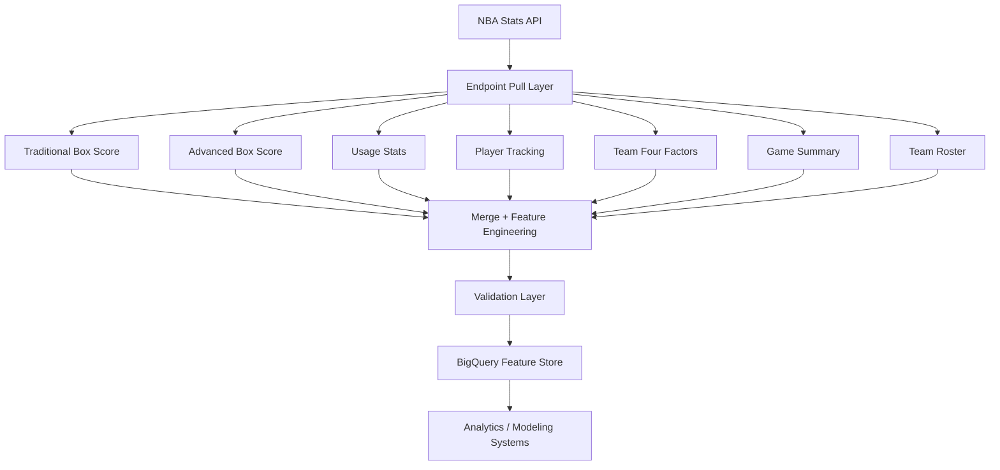

# NBA Feature Store Pipeline

## Overview

This project implements a production-style NBA data pipeline that ingests player game statistics from the NBA Stats API and stores them in a partitioned Google BigQuery feature store.

The system retrieves data from multiple NBA API endpoints, merges player-level statistics, performs validation checks, and loads the results into a structured analytics warehouse designed for modeling and downstream analysis.

This repository represents Phase 1 — Data Infrastructure, which builds the core feature store layer used for sports analytics and predictive modeling workflows.

The pipeline was initially prototyped in a notebook environment and later refactored into a modular Python data pipeline following common data engineering architecture patterns.

---

## Architecture



This architecture follows a typical analytics engineering pipeline pattern separating ingestion, feature engineering, validation, and warehouse storage layers.

---

## Key Features

- Multi-endpoint NBA API ingestion
- Retry-protected API calls with exponential backoff
- Adaptive rate limiting to prevent API throttling
- Schema-locked warehouse design
- Partitioned BigQuery feature store
- Idempotent ingestion (safe reruns)
- Data validation safeguards
- Automated integrity audits and monitoring tools

These safeguards ensure the pipeline remains stable, reliable, and reproducible during daily ingestion.

---

## Feature Store Table

`pr_see_daily_player_game_log`

### Partitioning

`GAME_DATE`

### Clustering

`PLAYER_ID`  
`TEAM_ID`

Partition filtering is enforced to prevent accidental full-table scans and control BigQuery query costs.

The feature store is designed to support modeling-ready player game features.

---

## Data Sources

NBA Stats API endpoints used in this pipeline:

- boxscoretraditionalv3
- boxscoreadvancedv3
- boxscoreusagev3
- boxscoreplayertrackv3
- boxscorefourfactorsv3
- boxscoresummaryv3
- scoreboardv3
- commonteamroster

These endpoints are merged to generate a comprehensive player-level feature set for each NBA game.

---

## Technology Stack

Python  
NBA API (`nba_api`)  
Google BigQuery  
Pandas  
Requests  

---

## Pipeline Capabilities

### Reliable Data Ingestion

The pipeline implements retry logic with exponential backoff to protect against temporary API failures or unstable network conditions.

### Rate Limit Protection

An adaptive rate governor dynamically adjusts request pacing to prevent NBA Stats API throttling.

### Data Validation

Before ingestion the pipeline validates:

- duplicate row keys
- missing player IDs
- corrupted merges
- negative minutes
- empty dataframes

These safeguards prevent corrupted records from entering the feature store.

### Atomic Day-Level Ingestion

Each game date is processed as a complete atomic unit.

If any game fails during ingestion, the entire day is aborted to prevent partial or inconsistent data loads.

---

## Monitoring & Data Integrity

The pipeline includes operational monitoring tools for feature store health.

### Data Health Audit

Checks for:

- missing regular season dates
- duplicate row keys
- abnormal daily row counts

### Game Integrity Audit

Validates:

- every game contains exactly two teams
- teams have reasonable player counts
- no corrupted player rows exist

### Feature Store Command Center

Provides a high-level operational dashboard including:

- ingestion freshness
- total rows in warehouse
- total games ingested
- unique players observed
- number of partitions

These monitoring tools allow quick verification that the pipeline is functioning correctly.

---

## Project Structure

```
nba-feature-store
│
├── main.py
├── config.py
├── schema.py
│
├── ingestion
│   ├── ingestion_engine.py
│   └── pull_games.py
│
├── utils
│   ├── retry.py
│   ├── validation.py
│   ├── logging.py
│   └── dates.py
│
├── requirements.txt
├── README.md
│
└── notebook_prototype
    ├── feature_store_pipeline.ipynb
    └── Portfolio_Player_Stats_Generated_and_Logged_System.ipynb
```

### Structure Overview

main.py — pipeline entry point  
config.py — pipeline configuration and runtime settings  
schema.py — BigQuery feature store schema definition  
ingestion/ — ingestion engine and NBA API pull logic  
utils/ — reusable pipeline utilities (retry, validation, logging, date handling)  
notebook_prototype/ — original notebook used during early pipeline development  

The notebook prototype demonstrates the transition from exploratory development to a structured production pipeline.

---

## Running the Pipeline

Install dependencies:

```
pip install -r requirements.txt
```

Run the pipeline:

```
python main.py
```

Runtime behavior is controlled through `config.py` which supports both automatic daily ingestion and manual historical backfills.

---

## Future Work (Phase 2)

Phase 2 will extend the feature store into a full sports analytics system including:

- player projection models
- feature engineering pipelines
- performance modeling
- predictive analytics workflows

The current feature store serves as the data infrastructure foundation for these analytical systems.

---

## Author

ZH