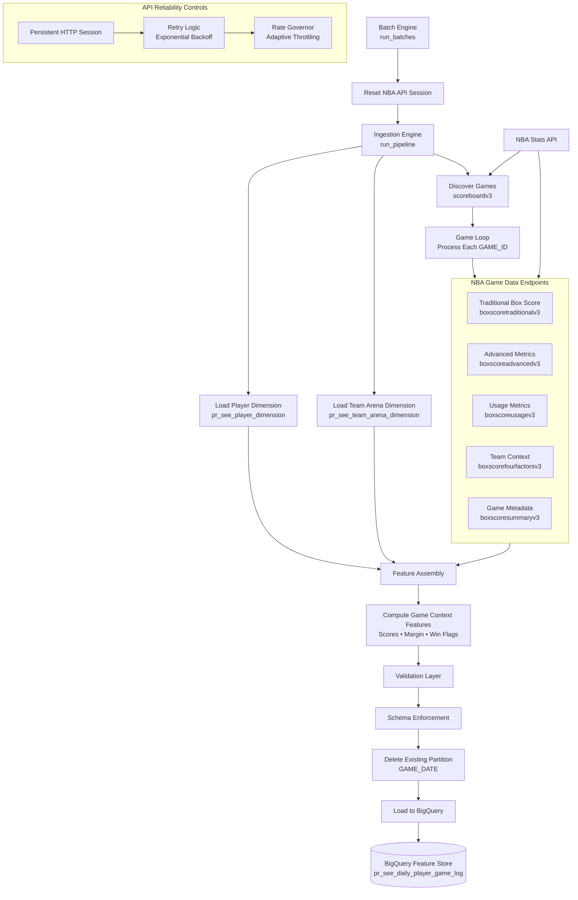
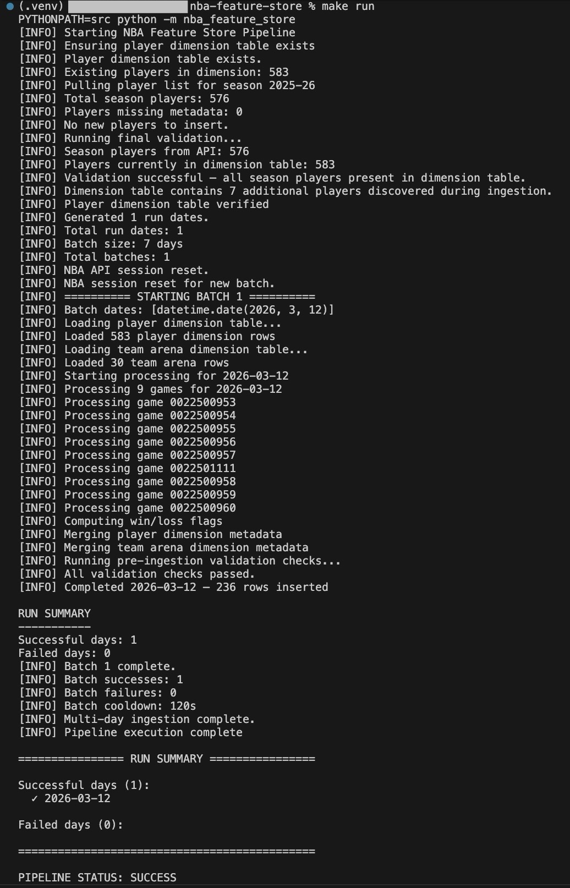
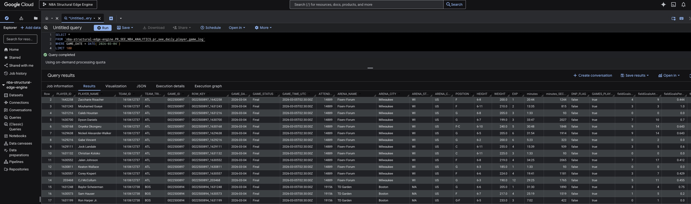
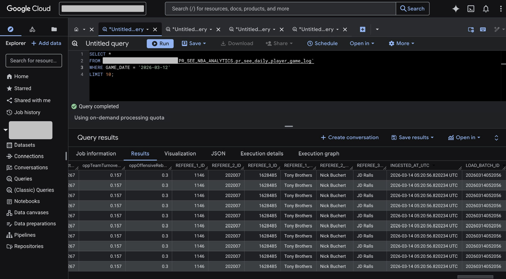
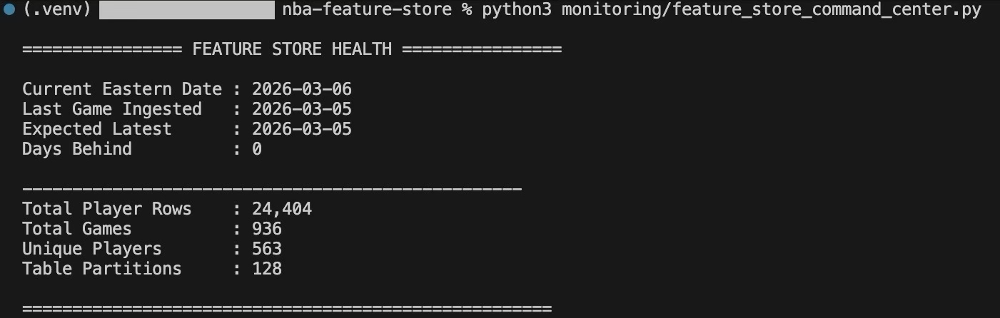
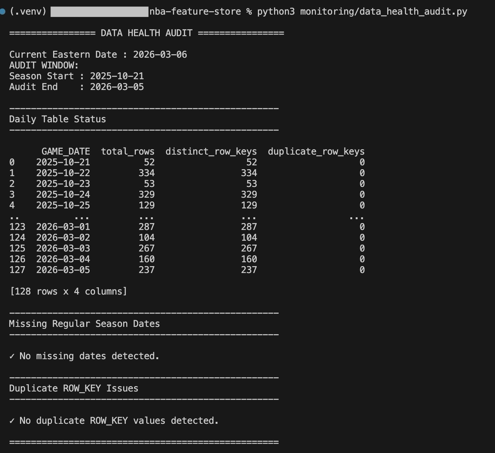
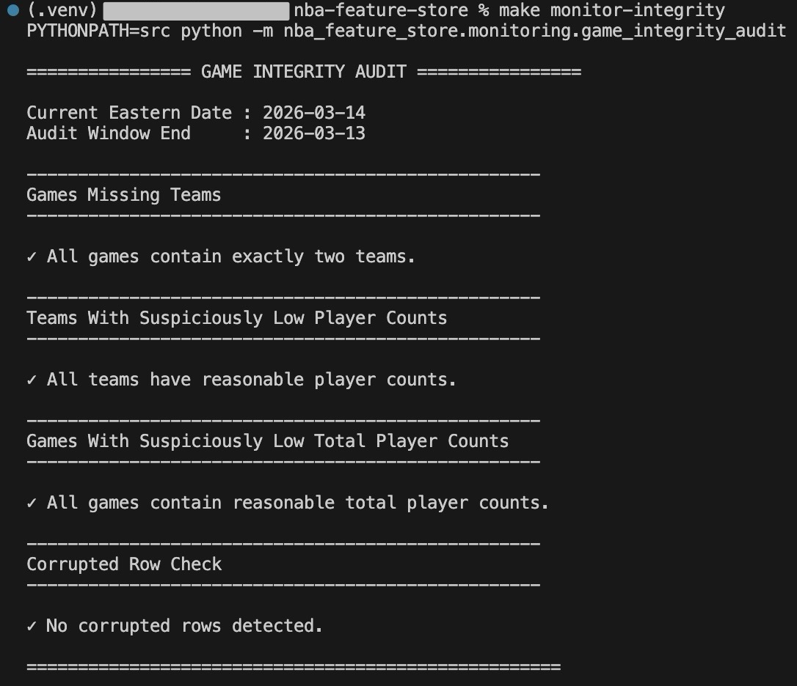

# NBA Feature Store Pipeline
Production-style NBA data pipeline that builds a partitioned BigQuery feature store from NBA Stats API endpoints for analytics and modeling workflows.

The pipeline is designed using modular data engineering architecture patterns including ingestion orchestration, schema enforcement, validation layers, and warehouse partitioning.


## What This Project Does

This project builds a **production-style sports analytics data pipeline** that:

• Collects NBA game data from the NBA Stats API  
• Merges multiple endpoints into player-level feature sets  
• Validates data integrity and schema consistency  
• Loads the results into a **partitioned BigQuery feature store**

The pipeline generates *105 player-level features per NBA game**.
Each NBA game date is processed as an **atomic ingestion unit**, ensuring that partial or corrupted data never enters the feature store.

NBA Stats API → Dimension Builder + Ingestion Engine → Validation Layer → BigQuery Feature Store

## Project Status

Production-style NBA data pipeline that ingests player-level game statistics from the NBA Stats API into a partitioned BigQuery feature store.

Current capabilities:

• Automated daily ingestion using `AUTO_YESTERDAY_MODE`  
• Partitioned BigQuery feature store optimized for analytical workloads  
• Player dimension table for centralized player metadata management  
• Team arena dimension table for normalized venue metadata  
• Multi-endpoint NBA API ingestion and feature assembly  
• Raw JSON ingestion fallback for `BoxScoreSummaryV3` to bypass known nba_api parser issues  
• Schema enforcement guaranteeing a consistent warehouse structure  
• Data validation safeguards preventing corrupted records from entering the warehouse  
• Idempotent ingestion enabling safe reruns and historical reprocessing  
• Retry logic with exponential backoff for unstable API calls  
• Adaptive rate governance to prevent NBA Stats API throttling  
• Automated player dimension backfill for newly discovered players during ingestion  
• Monitoring dashboards and warehouse integrity audits  
• Historical backfill engine with batch safety guardrails

The pipeline currently generates **105 player-level features per NBA game**, combining statistics from multiple NBA Stats API endpoints with metadata from dimension tables and derived game context features.

This repository represents **Phase 1: Data Infrastructure** for a larger sports analytics platform.

---

## Overview

This project implements a production-style NBA data pipeline that ingests player game statistics from the NBA Stats API and stores them in a partitioned Google BigQuery feature store.

The system retrieves data from multiple NBA API endpoints, merges player-level statistics, performs validation checks, and loads the results into a structured analytics warehouse designed for modeling and downstream analysis.

This repository represents **Phase 1 — Data Infrastructure**, which builds the core feature store layer used for sports analytics and predictive modeling workflows.

The pipeline was initially prototyped in a notebook environment and later refactored into a modular Python data pipeline following common data engineering architecture patterns.

---

## Architecture



The pipeline follows a modular data engineering architecture. NBA game data is collected from multiple NBA Stats API endpoints and merged into player-level feature sets. A dedicated dimension builder maintains a centralized player metadata table, which is joined during ingestion to enrich game-level statistics. The ingestion engine performs validation checks before loading the final dataset into a partitioned BigQuery feature store designed for analytical workloads and modeling pipelines.

This architecture separates **dimension construction** from the daily ingestion pipeline.

Game data is collected from multiple NBA Stats API endpoints and merged into player-level feature sets.  
Stable player metadata is stored in a dimension table and joined during ingestion to enrich the final dataset before loading into the BigQuery feature store.

---

## Pipeline Workflow

A typical pipeline run follows the sequence below:

1. Game Discovery  
   The pipeline queries the NBA `scoreboardv3` endpoint to identify all games scheduled for the ingestion date.

2. Endpoint Collection  
   For each game, the pipeline retrieves player-level statistics from multiple NBA Stats API endpoints including traditional box score, advanced metrics, usage statistics, and four-factor data.

3. Player Metadata Enrichment  
   A persistent player dimension table is maintained using metadata from `commonallplayers` and `commonplayerinfo`.  
   During ingestion this dimension table is joined to player game logs to enrich each record with player attributes.

4. Feature Assembly

   Endpoint data is merged into a unified player-level feature set containing 92 statistics and contextual metrics collected from multiple NBA Stats API endpoints.

   During ingestion, the dataset is enriched with:

   • 3 player metadata attributes from the player dimension table  
  (POSITION, HEIGHT, EXP)

   • 3 arena metadata attributes from the team arena dimension table  
  (ARENA_NAME, ARENA_CITY, ARENA_STATE)

   The pipeline also derives game outcome features including:

• HOME_TEAM_POINTS — total points scored by the home team  
• AWAY_TEAM_POINTS — total points scored by the away team  
• POINT_MARGIN — point differential relative to the player's team  
• GAME_TOTAL_POINTS — combined score of both teams  

• HOME_TEAM_WIN_FLAG — boolean indicator showing whether the home team won the game  
• PLAYER_TEAM_WIN_FLAG — boolean indicator showing whether the player's team won the game  

   These enrichments produce **105 total player-level features per NBA game** stored in the final BigQuery feature store.

5. Validation Layer  
   Multiple validation checks ensure data integrity before warehouse loading, including required column validation, duplicate row key detection, duplicate column detection, player ID validation, negative minutes checks, empty dataset protection, and a global null-value guard that prevents ingestion if any column contains missing values.

6. Warehouse Load  
   Validated records are written to a partitioned BigQuery feature store table using the game date as the partition key.

7. Monitoring and Auditing  
   Post-ingestion monitoring utilities audit the feature store for missing partitions, corrupted rows, and structural anomalies.

   ---

## Example Output

### Example Pipeline Execution

The pipeline runs as a command-line job and processes NBA game dates as atomic ingestion batches.

The default configuration runs in **AUTO_YESTERDAY_MODE**, which automatically ingests the previous day's NBA games.

Example pipeline execution:



### Feature Store Example

Example rows stored in the BigQuery feature store.

The table contains **105 player-level features** generated from multiple NBA Stats API endpoints.





### Example Dataset

A small sample dataset is included to demonstrate the structure of the
player-level feature store generated by the pipeline.

Location:

data/sample/example_player_game_log.csv

The dataset contains 10 rows of real pipeline output exported from BigQuery for a
single NBA game date. 

Each row represents a player's performance in a specific NBA game.

The full production feature store contains **105 player-level features per game**.

---

## System Requirements

The pipeline was developed and tested with the following environment:

- Python 3.11+
- Google Cloud Project with BigQuery enabled
- BigQuery API enabled
- Service account with BigQuery Admin permissions

Required Python packages are listed in:

requirements.txt

All dependencies can be installed with:

pip install -r requirements.txt

---

## Environment Variables

The pipeline uses the following environment variables:

GCP_PROJECT_ID
Required. Your Google Cloud project ID.

GOOGLE_APPLICATION_CREDENTIALS
Path to your Google Cloud service account JSON key.

PIPELINE_ALERT_EMAIL (optional)
Email used for pipeline failure alerts.

PIPELINE_ALERT_PASSWORD (optional)
Gmail App Password used to send failure alerts.

---

## Quick Start

### Clone the Repository

```bash
git clone https://github.com/zh412/nba-feature-store.git
cd nba-feature-store
```

### Create a Python Virtual Environment

```bash
python3 -m venv .venv
source .venv/bin/activate
```

### Install Dependencies

```bash
pip install -r requirements.txt
```

---

## Google Cloud Setup

This pipeline stores data in **Google BigQuery**, so you must first create a Google Cloud project and dataset.

### Create a Google Cloud Project

1. Go to the Google Cloud Console  
   https://console.cloud.google.com/

2. Create a new project.

3. Enable the **BigQuery API** for the project.

---

### Create a BigQuery Dataset

In the BigQuery console:

1. Select your project  
2. Click **Create Dataset**  
3. Create a dataset named:

```
PR_SEE_NBA_ANALYTICS
```

You may choose a different name if desired, but the name must match the value configured in `config.py`.

---

### Create a Service Account

1. Navigate to **IAM & Admin → Service Accounts**
2. Create a new service account
3. Grant the role:

```
BigQuery Admin
```

4. Generate and download a **JSON key**

---

### Configure Google Cloud Credentials

Set the environment variable pointing to your service account key.

```bash
export GOOGLE_APPLICATION_CREDENTIALS="/path/to/service_account.json"
```

Example:

```bash
export GOOGLE_APPLICATION_CREDENTIALS="/Users/username/service_account.json"
```

This allows the pipeline to authenticate with Google Cloud when writing data to BigQuery.

---

## Configure the Pipeline

The pipeline reads your **Google Cloud Project ID** from an environment variable.

Set the following variable before running the pipeline:

```bash
export GCP_PROJECT_ID="your-gcp-project-id"
```

Example:

```bash
export GCP_PROJECT_ID="my-gcp-project"
```

Inside the pipeline configuration, this value is automatically read using:

```python
PROJECT_ID = os.getenv("GCP_PROJECT_ID", "your-gcp-project-id")
```

This allows the repository to work for **any user who clones the project** without modifying the source code.

The pipeline will automatically use this value when constructing BigQuery table paths.

For convenience, you may add this variable to your shell profile so it is automatically available in future terminal sessions.

Example for macOS / Linux:

```bash
nano ~/.zshrc
```

Add the following line:

```bash
export GCP_PROJECT_ID="your-gcp-project-id"
```

Then reload your shell configuration:

```bash
source ~/.zshrc
```

---

### Optional Configuration

Advanced users may customize dataset and table names in:

```
src/nba_feature_store/config.py
```

Default values:

```python
DATASET_ID = "PR_SEE_NBA_ANALYTICS"

TABLE_NAME = "pr_see_daily_player_game_log"

PLAYER_DIMENSION_TABLE_NAME = "pr_see_player_dimension"

TEAM_ARENA_DIMENSION_TABLE_NAME = "pr_see_team_arena_dimension"
```

These defaults will work for most users.

The pipeline **automatically creates these tables if they do not already exist**.

---

Additional ingestion behavior can also be configured in `config.py`.

Key configuration options include:

```python
AUTO_YESTERDAY_MODE = True
```

When enabled, the pipeline automatically ingests **yesterday's NBA games** each time it runs.

```python
START_DATE
END_DATE
```

These parameters allow users to manually run historical backfills when `AUTO_YESTERDAY_MODE` is disabled.

```python
MAX_DAYS_PER_RUN
```

Limits how many days can be ingested in a single execution to prevent excessive NBA API requests.

```python
EXCLUDE_DATES
```

Allows specific dates to be skipped during ingestion (for example, the NBA All-Star break).

These configuration controls allow the pipeline to run in **fully automated daily mode** or perform **controlled historical backfills** while protecting the NBA Stats API from excessive load.

---

## Failure Email Alerts (Optional)

The pipeline can send email notifications if ingestion fails.

To enable alerts, set the following environment variables:

```
export PIPELINE_ALERT_EMAIL="your_email@gmail.com"
export PIPELINE_ALERT_PASSWORD="your_app_password"
```

You cannot use your normal Gmail password.  
You must use a **Google App Password**.

These credentials are used to send failure notifications via Gmail SMTP.

---

## Run the Pipeline

Run the ingestion pipeline:

```bash
make run
```

This executes the full ingestion process using the configuration defined in `config.py`.

Equivalent command:

```bash
PYTHONPATH=src python -m nba_feature_store
```

---

## Verify the Feature Store

After ingestion completes, you can verify the health of the feature store using the built-in monitoring tools.

Run the monitoring dashboard:

```bash
make monitor-command
```

Run data health checks:

```bash
make monitor-health
```

Run game integrity validation:

```bash
make monitor-integrity
```

Run all monitoring checks together:

```bash
make monitor-all
```

These tools validate ingestion completeness, detect duplicate records, and confirm that all NBA games contain the expected teams and player rows.

---

## Full Pipeline + Monitoring Workflow

To run the pipeline followed by the full monitoring suite:

```bash
make pipeline-run
```

This command executes the ingestion pipeline and then runs all monitoring checks to confirm the feature store is healthy.

---

This project uses a **`src/` package layout**, a common Python packaging pattern that isolates source code from repository root files and improves import reliability.

The pipeline is executed as a Python module to mirror production-style package execution.

### Default Behavior (AUTO_YESTERDAY_MODE)

By default the pipeline runs in **AUTO_YESTERDAY_MODE**.

This means the pipeline automatically ingests **yesterday’s NBA games** each time it runs.

Example:

If today is **March 5**, the pipeline will ingest **March 4 games**.

This mode is designed for **automated daily ingestion** during the NBA season.

### Running a Manual Date Range (Backfill)

If you want to ingest specific historical dates instead of yesterday's games, update the configuration in `config.py`. A maximum of 7 days should be run at a time to not overload the NBA API. 

Example:

```
AUTO_YESTERDAY_MODE = False
START_DATE = "2025-11-01"
END_DATE   = "2025-11-03"
```

Then:

Run the ingestion pipeline:

```bash
make run
```

Or Equivalent command:

```bash
PYTHONPATH=src python -m nba_feature_store
```

You could also run the pipeline followed by all monitoring checks together:

```bash
make pipeline-run
```

### Backfill Safety Guardrail

The pipeline includes a safety limit to prevent excessive API calls.

A maximum of **7 days can be processed per run**.

If you need to backfill a longer period, run the pipeline multiple times with different date ranges.

### Check Pipeline Health

After ingestion you can verify the feature store using the built-in monitoring tools.

Run individually:

make monitor-command     # Feature Store Command Center dashboard  
make monitor-health      # Data health audit (missing dates / duplicates)  
make monitor-integrity   # Game integrity validation  

Run all monitoring checks together:

make monitor-all

## Development Commands

Common development tasks can be run using the Makefile.

```
make install          # install dependencies
make lint             # run flake8
make test             # run unit tests

make run              # execute the ingestion pipeline

make monitor-command  # feature store command center
make monitor-health   # data health audit
make monitor-integrity# game integrity audit
make monitor-all      # run all monitoring checks

make pipeline-run     # run pipeline followed by all monitoring checks

```

The repository includes a GitHub Actions CI pipeline that automatically runs linting and tests on every commit to ensure code quality and stability.

## Testing

The repository includes a small unit test suite covering core pipeline utilities.

Run tests locally with:

```bash
pytest
```

The test suite validates key infrastructure components used by the ingestion pipeline including:

• date parsing utilities and time conversions  
• retry logic for resilient API calls  
• adaptive rate limiting through the rate governor  
• schema enforcement to prevent malformed data loads  

These tests ensure that critical pipeline safeguards behave correctly before data is written to the feature store.

All tests automatically run in the GitHub Actions CI pipeline on every commit to maintain code quality and reliability.

The tests focus on deterministic pipeline utilities rather than external API calls to ensure reliable and fast test execution.

---

## Monitoring

The pipeline includes built-in monitoring utilities that provide operational visibility into the health and integrity of the feature store. These tools are automatically executed when running:

make pipeline-run

These tools help verify ingestion completeness, detect data integrity issues, and monitor overall warehouse status after pipeline runs.

---

### Feature Store Command Center

Provides a high-level operational dashboard for the warehouse.

Key metrics include:

- ingestion freshness
- total rows stored
- total games ingested
- number of partitions

Run:

make monitor-command

Equivalent command:

PYTHONPATH=src python -m nba_feature_store.monitoring.feature_store_command_center



---

### Data Health Audit

Audits the feature store for common warehouse health issues.

Checks include:

- missing ingestion dates
- duplicate row keys
- abnormal daily row counts

Run:

make monitor-health

Equivalent command:

PYTHONPATH=src python -m nba_feature_store.monitoring.data_health_audit



---

### Game Integrity Audit

Validates the structural integrity of ingested NBA games.

Checks include:

- each game contains exactly two teams
- reasonable player counts per team
- no corrupted player rows

Run:

make monitor-integrity

Equivalent command:

PYTHONPATH=src python -m nba_feature_store.monitoring.game_integrity_audit



---

### Run All Monitoring Checks

To run the full monitoring suite after a pipeline run:

make monitor-all

This executes all monitoring tools sequentially to confirm the feature store is healthy and ingestion completed successfully.

---

## Core Pipeline Capabilities

The NBA Feature Store pipeline is designed using production-style data engineering patterns to ensure reliable ingestion, strict data integrity, and operational observability.

The system combines ingestion orchestration, validation safeguards, schema enforcement, and monitoring utilities to maintain a stable analytics warehouse.

---

### Automated Ingestion Orchestration

The pipeline is executed through a centralized entry point that coordinates all ingestion steps. Each run automatically:

- verifies the player dimension table exists
- generates the ingestion date range
- enforces backfill safety limits
- executes batch ingestion
- produces a run summary with success and failure counts

Exit codes are returned to the operating system so external schedulers can detect pipeline success or failure.

---

### Player Dimension Management

A dedicated dimension builder maintains a persistent metadata table for player attributes such as position, height, and experience.

If the dimension table does not exist, it is automatically created and populated using NBA Stats API endpoints.

During ingestion the dimension table is loaded and merged with player game logs to enrich each record with player metadata. The pipeline performs a fail-fast validation step to ensure all players in the dataset exist in the dimension table.

If the ingestion pipeline encounters a player that does not exist in the player dimension table, the system automatically retrieves metadata from the NBA Stats API using the commonplayerinfo endpoint, inserts the player into the dimension table, and retries ingestion for that game date. This prevents pipeline failures when new players appear mid-season.

---

### Multi-Endpoint Feature Assembly

Player game features are constructed by combining data from multiple NBA Stats API endpoints.

For each discovered game the pipeline retrieves:
	•	traditional box score statistics
	•	advanced metrics
	•	usage statistics
	•	four factor metrics
	•	game metadata
	•	team context features

These datasets are merged into a unified player-level feature set containing 92 statistics and contextual metrics for every player game.

During ingestion, the dataset is enriched with stable player attributes from the player dimension table and arena metadata from the team arena dimension table. Additional derived game context features, including team scores, point margin, total game points, and win/loss indicators, are computed before loading the final dataset into the BigQuery feature store.

---

### API Reliability Safeguards

The ingestion system includes multiple safeguards to maintain stability when interacting with the NBA Stats API.

These include:
	•	retry logic with exponential backoff for unstable API requests
	•	retry protection applied to all endpoints including scoreboardv3 game discovery
	•	persistent HTTP session pooling to reuse connections and improve request stability
	•	adaptive request rate governance to prevent API throttling
	•	automatic cooldown periods between individual games and ingestion days
	•	session resets between multi-day ingestion batches to maintain API stability

These controls allow the pipeline to safely perform both daily ingestion and historical backfills while minimizing the risk of API throttling or transient request failures.

---

### Data Validation Layer

Before any data is written to the warehouse, the pipeline performs multiple validation checks to protect the integrity of the feature store.

Validation safeguards include:

- required column verification
- duplicate row key detection
- duplicate column detection
- player identifier validation
- negative minutes detection
- empty dataset protection
- global null-value guards that abort ingestion if any column contains missing values

These checks ensure corrupted or incomplete records never enter the warehouse.

---

### Schema Enforcement

The pipeline enforces a strict warehouse schema before loading data into BigQuery.

Missing columns are automatically added when necessary and all columns are aligned to the expected schema definition before ingestion. This guarantees consistent column ordering and data types across all pipeline runs.

---

### Idempotent Warehouse Loading

The feature store is implemented as a partitioned BigQuery table using `GAME_DATE` as the partition key.

To ensure safe reprocessing of historical data:

- the target partition is deleted before loading new records
- ingestion metadata is added to each row
- post-load verification checks confirm that the expected number of rows were successfully written

This design allows historical dates to be safely re-ingested without creating duplicate records.

---

### Batch Processing and Backfill Control

Historical ingestion is handled through a batch engine that processes multiple dates in controlled chunks.

The batch system:

- splits ingestion runs into configurable date batches
- resets API sessions between batches
- applies cooldown periods to prevent API throttling
- tracks successful and failed ingestion days

A safety guardrail prevents more than a configured number of days from being processed in a single run.

---

### Operational Observability

The pipeline includes multiple observability features that provide insight into ingestion runs.

These include:

- structured logging throughout the pipeline
- detailed run summaries
- ingestion success and failure tracking
- batch execution reporting

This information is printed during execution and written to local pipeline logs for troubleshooting.

---

### Failure Alerting

If the pipeline encounters a fatal error, an automated email alert can be triggered using configured environment variables.

Failure alerts include the error message and notify operators that the pipeline requires attention.

---

### Monitoring and Integrity Audits

In addition to runtime safeguards, the repository includes monitoring utilities that audit the health of the feature store after ingestion.

These tools verify warehouse completeness, validate game integrity, and provide operational dashboards for ingestion monitoring.

Together these capabilities allow the system to function as a reliable production-style data pipeline for sports analytics workloads.

---

## Feature Store Design

The pipeline loads player-level NBA game statistics into a partitioned Google BigQuery feature store designed for analytics and modeling workloads.

The warehouse follows a simplified star-schema design that separates **stable player metadata** from **game-level performance features**.

Two dimension tables are maintained to store metadata that does not change on a per-game basis:

• a **player dimension table** containing player attributes  
• a **team arena dimension table** containing arena metadata

These dimension tables are built and maintained independently of the daily ingestion pipeline and are joined during ingestion to enrich player game records before loading them into the feature store.

This design reduces redundant API calls, improves data consistency, and keeps slowly changing metadata separate from high-volume game statistics.

The primary feature store table contains player-level game statistics generated by merging multiple NBA Stats API endpoints. Each row represents a single player in a single NBA game and includes traditional box score statistics, advanced metrics, usage features, team context variables, and derived game outcome features.

The table is partitioned by `GAME_DATE` to support efficient time-series queries and prevent full-table scans. Clustering by `PLAYER_ID` and `TEAM_ID` improves query performance for common analytical workloads such as player trend analysis, matchup evaluation, and team-level aggregations.

The ingestion pipeline uses idempotent loading patterns to maintain warehouse consistency. Existing partitions are replaced before new records are written, allowing historical game dates to be safely reprocessed without creating duplicate records.

Additional ingestion metadata such as `INGESTED_AT_UTC` and `LOAD_BATCH_ID` are included with every record to support observability, lineage tracking, and debugging of historical pipeline runs.

Together these design choices create a reliable feature store optimized for downstream analytics, modeling pipelines, and sports analytics research.

The final feature store contains **105 player-level features per game**, composed of:

• **92 game statistics** collected from NBA Stats API endpoints  
• **3 stable player attributes** joined from the player dimension table  
• **3 arena metadata attributes** joined from the team arena dimension table  
• **7 derived game context features** computed during ingestion including team scores, point margin, total game points, and win/loss indicators

---

### Player Dimension Table

`pr_see_player_dimension`

The player dimension table stores metadata attributes that do not change on a per-game basis.

Columns:

- PLAYER_ID
- POSITION
- HEIGHT
- EXP

This table is built automatically by the pipeline if it does not already exist.

The dimension builder retrieves metadata from the NBA Stats API endpoints:

- `commonallplayers`
- `commonplayerinfo`

During ingestion, the pipeline loads this dimension table and joins it to player game logs to enrich each row with player metadata before loading the final dataset into the feature store.

---

### Team Arena Dimension Table

`pr_see_team_arena_dimension`

The team arena dimension table stores stable arena metadata for each NBA franchise.

Columns:

- TEAM_ID
- TEAM_TRICODE
- ARENA_NAME
- ARENA_CITY
- ARENA_STATE

This table contains one row per NBA team and provides normalized venue information used to enrich player game records.

The dimension is built automatically by the pipeline if it does not already exist. Arena metadata is derived from team information returned by NBA Stats API endpoints and maintained as a persistent reference table.

During ingestion, the pipeline joins this dimension table using the `HOME_TEAM_ID` field to append arena information to each player game record. This ensures consistent venue metadata across all games without repeatedly retrieving the same information during API calls.

---

### Player Game Feature Store

`pr_see_daily_player_game_log`

This table contains player-level game features generated by merging multiple NBA Stats API endpoints.

Each row represents a **single player in a single NBA game**.

The pipeline generates **105 player-level features per game** including traditional statistics, advanced metrics, usage statistics, team context features, arena metadata, and derived game outcome variables.

#### Partitioning

`GAME_DATE`

Partitioning by game date allows efficient time-series queries and prevents full-table scans.

#### Clustering

`PLAYER_ID`  
`TEAM_ID`

Clustering improves query performance for common analytical workloads such as:

- player performance trends
- team-level aggregations
- matchup analysis

Partition filtering is enforced to control BigQuery query costs and maintain warehouse efficiency.

---

### Example Feature Store Schema

| Column | Description |
|------|-------------|
| GAME_ID | Unique NBA game identifier |
| PLAYER_ID | NBA player identifier |
| TEAM_ID | Team identifier |
| minutes_SECONDS | Minutes played converted to seconds |
| POSITION | Player position from dimension table |
| HEIGHT | Player height from dimension table |
| EXP | Player experience (years in league) |
| INGESTED_AT_UTC | Pipeline ingestion timestamp |
| LOAD_BATCH_ID | Unique batch identifier |

Full schema documentation is available in:

docs/data_model.md

---

## Data Sources

The pipeline collects data from multiple NBA Stats API endpoints to construct a comprehensive player-level feature set for every NBA game.

Each pipeline run begins by discovering games for a specific date, then retrieving player statistics, team context data, and metadata from several endpoints. These datasets are merged into a unified player-level feature table before being validated and loaded into the BigQuery feature store.

The ingestion process combines **player statistics, game metadata, team context metrics, and stable player attributes** into a single analytics dataset designed for downstream modeling and sports analytics workflows.

---

### Game Discovery

The pipeline first identifies all games played on the ingestion date using:

- `scoreboardv3`

This endpoint provides the schedule of games for a specific date and acts as the entry point for the ingestion process.

Each discovered `GAME_ID` is processed individually by the ingestion engine. The pipeline retrieves all player statistics and contextual data associated with that game before merging the results into a unified player-level feature set.

---

### Player Box Score Statistics

For every game, multiple box score endpoints are queried to collect player-level performance metrics.

- `boxscoretraditionalv3`
- `boxscoreadvancedv3`
- `boxscoreusagev3`
- `boxscorefourfactorsv3`

These endpoints provide different categories of basketball analytics data.

**Traditional box score statistics**

Examples include:

- points  
- rebounds  
- assists  
- steals  
- blocks  
- field goals made and attempted  
- plus/minus  

These metrics describe the raw performance of a player within a specific game.

**Advanced efficiency metrics**

Examples include:

- offensive rating  
- defensive rating  
- net rating  
- true shooting percentage  
- effective field goal percentage  

These metrics provide efficiency-based evaluations of player performance.

**Usage statistics**

Usage metrics describe how heavily a player was involved in offensive possessions.

Examples include:

- usage percentage  
- percentage of team field goals  
- percentage of team assists  
- percentage of team points  

**Four-factor metrics**

Four-factor statistics provide team-level context describing overall team performance in the game.

Examples include:

- effective field goal percentage  
- turnover percentage  
- offensive rebound percentage  
- free throw rate  

The pipeline merges these datasets to construct a comprehensive feature set describing each player's performance within a specific NBA game.

---

### Game Metadata

Additional contextual information about each NBA game is retrieved using the NBA Stats API endpoint:

- `boxscoresummaryv3`

This endpoint provides game-level metadata used to enrich the player-level dataset.

Examples of metadata extracted include:

- team identifiers  
- team abbreviations  
- final team scores  
- game status  
- scheduled game start time  
- referee assignments  

During development it was discovered that the official `nba_api` parser for `BoxScoreSummaryV3` occasionally fails when the NBA Stats API returns incomplete structures for certain games. In some cases the API response contains missing arena information or incomplete team period data, which causes the parser to attempt to access attributes on `None` objects and raise errors such as:

```
AttributeError: 'NoneType' object has no attribute 'get'
```

Because these failures occur intermittently depending on the structure of the NBA Stats API response, relying on the built-in parser can cause ingestion failures for otherwise valid games.

To ensure pipeline reliability, the ingestion system bypasses the `nba_api` parser for this endpoint and instead reads the **raw JSON response** returned by the NBA Stats API. The required metadata fields are then extracted manually within the ingestion layer.

This approach prevents ingestion failures caused by parser assumptions while preserving the full set of metadata required by the feature store. The extracted metadata is merged with player-level statistics during feature assembly before the dataset passes through the validation layer and is written to the BigQuery feature store.

---

### Player Metadata

Stable player attributes are retrieved using:

- `commonallplayers`
- `commonplayerinfo`

These endpoints provide metadata including:

- player identifiers  
- player positions  
- height  
- years of NBA experience  

The pipeline builds and maintains a persistent **player dimension table** using this information.

During ingestion, the dimension table is joined to player game statistics to enrich each record with player attributes while avoiding repeated API calls.

If the ingestion pipeline encounters a player that does not yet exist in the dimension table (for example a newly signed player), the system automatically retrieves metadata for that player, inserts the record into the dimension table, and retries ingestion for the affected game date.

---

### Arena Metadata

Arena metadata is maintained in a dedicated dimension table built by the pipeline.

The **team arena dimension table** contains venue information for each NBA franchise including:

- arena name  
- arena city  
- arena state  

This metadata is joined to the dataset during ingestion using the `HOME_TEAM_ID` field.

Maintaining arena metadata in a dimension table avoids repeated API calls and ensures consistent venue information across all games.

---

By combining data from these endpoints and dimension tables, the pipeline generates a unified dataset containing **105 player-level features per NBA game**.

These features include:

- traditional box score statistics  
- advanced efficiency metrics  
- usage statistics  
- team context variables  
- player metadata  
- arena metadata  
- derived game outcome features  

The final dataset is validated by the pipeline's data integrity layer and loaded into the partitioned BigQuery feature store for downstream analytics and modeling workflows.

---

## Technology Stack

The NBA Feature Store pipeline is implemented using a lightweight Python-based data engineering stack designed for reliability, reproducibility, and operational observability.

### Core Languages and Libraries

- **Python** — primary language used for pipeline orchestration and data processing
- **Pandas** — dataframe manipulation and feature assembly
- **Requests** — HTTP client used for API communication
- **nba_api** — Python wrapper for the NBA Stats API

### Cloud and Data Warehouse

- **Google BigQuery** — analytical data warehouse used for the feature store
- **Google Cloud Platform (GCP)** — cloud infrastructure environment
- **google-cloud-bigquery** — Python client for BigQuery ingestion and queries

### Pipeline Infrastructure

- **Makefile** — standardized commands for running pipeline tasks and monitoring tools
- **cron** — lightweight scheduler for automated daily pipeline execution
- **Python logging utilities** — structured pipeline logging and observability

### Reliability and Data Quality

- **Custom validation framework** — pre-ingestion data validation and integrity checks
- **Schema enforcement layer** — guarantees consistent warehouse schema across runs
- **Retry logic with exponential backoff** — protects against unstable API requests
- **Adaptive rate governor** — prevents NBA API throttling

### Testing and Code Quality

- **Pytest** — unit testing framework for pipeline utilities
- **Flake8** — Python linting and style enforcement
- **GitHub Actions** — continuous integration pipeline for automated testing and linting

---

## Project Structure

```
nba-feature-store
│
├── src
│   └── nba_feature_store
│       ├── __init__.py
│       ├── __main__.py
│       ├── main.py
│       ├── config.py
│       ├── schema.py
│       │
│       ├── dimensions
│       │   ├── build_player_dimension.py
│       │   └── build_team_arena_dimension.py
│       │
│       ├── ingestion
│       │   ├── ingestion_engine.py
│       │   ├── pull_games.py
│       │   ├── batch_engine.py
│       │   ├── team_context.py
│       │   └── game_metadata.py
│       │
│       ├── utils
│       │   ├── retry.py
│       │   ├── validation.py
│       │   ├── logging.py
│       │   ├── dates.py
│       │   ├── nba_session.py
│       │   ├── rate_governor.py
│       │   ├── schema_enforcer.py
│       │   ├── post_load_check.py
│       │   ├── run_tracker.py
│       │   └── email_alert.py
│       │
│       └── monitoring
│           ├── data_health_audit.py
│           ├── game_integrity_audit.py
│           └── feature_store_command_center.py
│
├── tests
│   ├── test_dates.py
│   ├── test_retry.py
│   ├── test_rate_governor.py
│   └── test_schema_enforcer.py
│
├── data
│   └── sample
│       └── example_player_game_log.csv
│
├── docs
│   ├── data_health_audit.png
│   ├── data_model.md
│   ├── feature_store_command_center.png
│   ├── feature_store_example_1.png
│   ├── feature_store_example_2.png
│   ├── game_integrity_audit.png
│   ├── nba_feature_store_pipeline_architecture.png
│   └── pipeline_run.png
│
├── logs
│
├── .github
│   └── workflows
│       └── ci.yml
│
├── requirements.txt
├── pytest.ini
├── Makefile
├── README.md
└── LICENSE
```

### Structure Overview

**main.py** — pipeline entry point responsible for orchestrating ingestion runs.  
Coordinates player dimension initialization, date generation, batch execution, and final run summaries.

**config.py** — centralized pipeline configuration including BigQuery project settings, dataset configuration, ingestion mode, and date range controls.

**schema.py** — BigQuery feature store schema definition used to enforce a consistent warehouse structure and column ordering during ingestion.

**dimensions/** — contains the player dimension builder responsible for creating and maintaining the persistent player metadata table using NBA Stats API endpoints.

**ingestion/** — core ingestion framework responsible for retrieving NBA game data, merging endpoint responses, enriching player records, and preparing player-level feature sets before warehouse loading.

**utils/** — reusable pipeline utilities including retry logic, validation checks, logging, NBA API session management, rate limiting, schema enforcement, post-load verification, and run tracking.

**monitoring/** — operational monitoring tools used to audit feature store health, detect data integrity issues, and provide warehouse status dashboards after pipeline runs.

**tests/** — unit tests for critical pipeline utilities such as retry logic, schema enforcement, date handling, and rate governance.

**docs/** — documentation assets including architecture diagrams, pipeline execution screenshots, and monitoring dashboard examples.

**data/sample/** — example dataset demonstrating the structure of the player-level feature store output generated by the pipeline.

---

## Pipeline Automation

The pipeline is designed to run automatically once per day during the NBA season.

A lightweight local scheduler is configured using cron to execute the pipeline at 1:00 PM Eastern Time, which ingests the previous day’s NBA games and runs the full monitoring suite.

0 13 * * * cd ~/nba-feature-store && mkdir -p logs && source .venv/bin/activate && make pipeline-run >> logs/pipeline_$(date +\%Y-\%m-\%d).log 2>&1

This command performs the following steps:

1. Navigates to the local repository directory (`~/nba-feature-store`)
2. Ensures the `logs/` directory exists for pipeline output
3. Activates the Python virtual environment used by the project
4. Executes the full pipeline workflow using the Makefile (`make pipeline-run`)
5. Runs all monitoring checks after ingestion
6. Writes pipeline output to a dated log file for debugging and observability

Example log output location:

logs/pipeline_2026-03-08.log

Using dated log files prevents a single log file from growing indefinitely and makes it easier to inspect the output of individual pipeline runs.

This automation ensures the BigQuery feature store remains continuously updated without manual intervention.

Cron Schedule Format

* * * * *
│ │ │ │ │
│ │ │ │ └── day of week
│ │ │ └──── month
│ │ └────── day of month
│ └──────── hour
└────────── minute

The schedule:

0 13 * * *

means the pipeline runs every day at **1:00 PM**.

### Why 1:00 PM?

NBA games frequently finish after midnight due to late West Coast start times. Running the pipeline at **1 PM Eastern Time** ensures that all games from the previous day have completed and that the NBA Stats API endpoints have finalized the box score data before ingestion begins.

The pipeline also includes several safeguards to ensure reliable automated operation:

• retry logic with exponential backoff for unstable API calls  
• adaptive rate limiting to prevent NBA Stats API throttling  
• failure detection with optional email alert notifications  

Together these mechanisms allow the system to operate as a reliable automated data pipeline that continuously updates the BigQuery feature store during the NBA season.

---

## Future Work (Phase 2)

Phase 2 will extend the feature store into a full sports analytics system including:

- player projection models
- feature engineering pipelines
- performance modeling
- predictive analytics workflows

The current feature store serves as the data infrastructure foundation for these analytical systems.

---

## Author

ZH